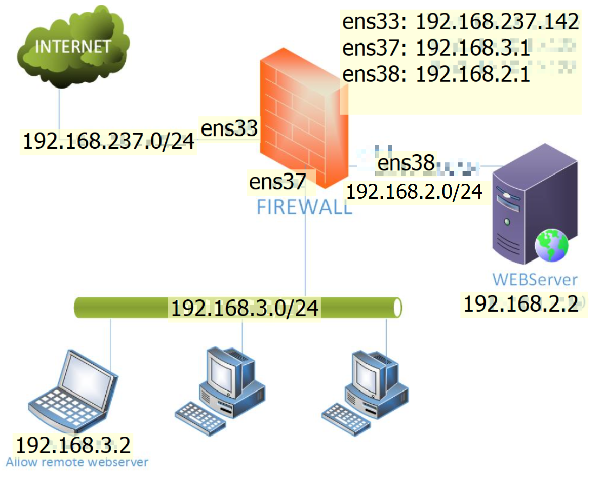
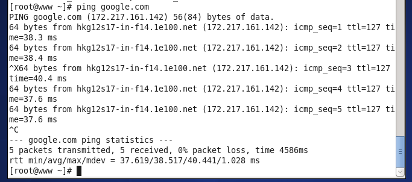
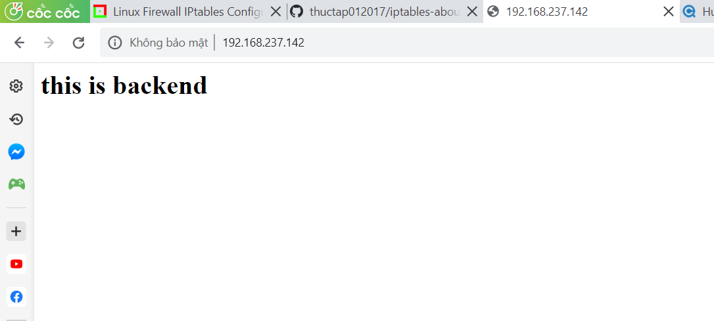

# Cấu hình tường lửa Iptables

## 1.1. Khái niệm về Iptables

- `iptables` là một ứng dụng dùng để quản lý filtering gói tin và NAT rules hoạt động trên console của linux rất nhỏ và tiện dụng. Được cung cấp miễn phí nhằm nâng cao tính bảo mật trên hệ thống Linux.

- `iptables` bao gồm 2 phần là `netfilter` nằm bên trong nhân Linux và `iptables` nằm ở vùng ngoài nhân. `iptables` chịu trách nhiệm giao tiếp với người dùng và sau đó đẩy rules của người dùng vào cho `netfilter` xử lý. `netfilter` thực hiện công việc lọc các gói tin ở mức IP. `netfilter` làm việc trực tiếp ở trong nhân của Linux nhanh và không làm giảm tốc độ của hệ thống.

- `iptables` cung cấp các tính năng sau:

  - Có khả năng phân tích gói tin hiệu quả.
  - Filtering gói tin dựa vào MAC và một số cờ hiệu (flags) trong TCP Header.
  - Cung cấp kỹ thuật NAT, chi tiết cho các tùy chọn để ghi nhận sự kiện hệ thống.
  - Có khả năng ngăn chặn một số cơ chế tấn công theo kiểu DoS.
  - Xây dựng một hệ thống tường lửa (firewall).
  - Cung cấp, xây dựng và quản lý các rule để xử lý các gói tin. 

  # 1.2. Command iptables

  ## 1.2.1 Cú  pháp

  ```
  iptables [-t table] command [chain] [match] [target/jump]
  ```

  \- Thứ tự các tham số có thể thay đổi nhưng cú pháp trên là dễ hiểu nhất.
  \- Nếu không chỉ định `table`, mặc định sẽ là table filter.
  \- `command` sẽ chỉ định chương trình phải làm gì.
  VD: Insert rule hoặc thêm rule đến cuối của chains.
  \- `chain` phải phù hợp với `table` được chỉ định.
  \- `match` là phần của rule mà chúng ta gửi cho kernel để biết chi tiết cụ thể của gói tin, điều gì làm cho nó khác với các gói tin khác.
  VD: địa chỉ IP, port, giao thức hoặc bất cứ điều gì.
  \- Cuối cùng là `target` của gói tin. Nếu phù hợp với match, chúng tôi sẽ vói với kernel phải làm những gì với gói tin này.

  ## 1.2.2. Command

  \- command nói cho iptables biết phải làm gì với phần còn lại của rule. Thông thường chúng ta muốn thêm hoặc xóa 1 cái gì đó trong bảng. Các command sau có sẵn trong iptables.
  \- **command**

  | Command            | Ví dụ                                                        | Ý nghĩa                                                      |
  | ------------------ | ------------------------------------------------------------ | ------------------------------------------------------------ |
  | -A, --append       | iptables -A INPUT                                            | thêm rule vào cuối của chains.                               |
  | -D, --delete       | iptables -D INPUT --dport 80 -j DROP **hoặc** iptables -D INPUT 1 | xóa rule của chain. Điều này có thể được thực hiện theo 2 cách; bằng cách nhập cả rule để khớp (như trong vd đầu tiên), hoặc bằng cách chỉ định số thứ tự của rule mà bạn muốn xóa. Các rules được đánh số từ đầu đến cuối đối với mỗ chain, bắt đầu với số thứ tự 1. |
  | -R, --replace      | iptables -R INPUT 1 -s 192.168.0.1 -j DROP                   | thay thế rule cũ tại dòng chỉ định. Nó sẽ làm việc tương tự như câu lệnh --delete, nhưng thay vì xóa, nó sẽ thay thế nó bằng mục nhập mới. |
  | -I, --insert       | iptables -I INPUT 1 --dport 80 -j ACCEPT                     | Insert rule vào chain. Rule được insert vào như rule đầu tiên. Nói cách khác, trong ví dụ trên, rule sẽ được chèn vào làm rule 1 trong chain INPUT. |
  | -L, --list         | iptables -L INPUT                                            | Liệt kê tất cả các rules trong chain chỉ định. Nếu không chỉ định chain, nó sẽ liệt kê tất cả các chain trong table. Đầu ra phụ thuộc bởi các tùy chọn khác như tùy chọn -n và -v, … |
  | -F, --flush        | iptables -F INPUT                                            | xóa tất cả các rule trong chain chỉ định trong bảng chỉ định. |
  | -Z, --zero         | iptables -Z INPUT                                            | This command tells the program to zero all counters in a specific chain, or in all chains. |
  | -N, --new-chain    | iptables -N allowed                                          | Câu lệnh nói với kernel tạo chain mới với tên được chỉ định trong table chỉ định. Trong ví dụ trên, chúng ta tạo chain được gọi là allowed. Tên của chain mới không được giống tên của chain và target đã tồn tại. |
  | -X, --delete chain | iptables -X allowed                                          | Xóa chain được chỉ định từ tables. Bạn phải xóa tất cả các rule của chain trước khi xóa chain. Nếu lệnh này sử dụng với không tùy chọn, tất cả các chains được xây dựng sẽ bị xóa. |
  | -P, --policy       | iptables -P INPUT DROP                                       | Câu lệnh nói với kernel để thiết lập target mặc định, hoặc policy của chain. Tất cả các gói tin không phù hợp với bất kỳ rule nào sẽ bị buộc phải sử dụng policy của chain. Target thường là DROP hoặc ACCEPT. |
  | -E, --rename-chain | iptables -E allowed disallowed                               | Câu lệnh nói với iptables rằng cần thay đổi tên của chain. VD trên, tên chain được thay đổi từ **allowed** đến **disallowed**. Chú ý: Điều này sẽ không ảnh hướng đến phương thức thực tế của tables sẽ làm việc. |

  \- **Option**

  

  | Option             | các command được sử dụng với                    | Ý nghĩa                                                      |
  | ------------------ | ----------------------------------------------- | :----------------------------------------------------------- |
  | -v, --verbose      | --list, --append, --insert, --delete, --replace | - Lệnh thường được sử dụng với tùy chọn **--list**. Nếu được sử dụng với tùy chọn **--list**, output sẽ là các địa chỉ interface, tùy chọn của rule và TOS masks. Lệnh **--list** cũng bao gồm bộ đếm bytes và gói tin cho mỗi rule, nếu tùy chọn **--verbose** được thiết lập. Bộ đếm sử dụng hệ số nhân K (x1000), M(x1000.000) và G (x1000.000.000). Để nhận kết quả chính xác bạn có thể sử dụng tùy chọn **-x**. |
  | -x, --exact        | --list                                          | Output từ lệnh **--list** sẽ không chứa hệ số nhân K, M hoặc G. Thay vào đó, chúng ta sẽ nhận được kết quả chính xác từ các gói tin và bytes. |
  | -n, --numeric      | --list                                          | Tùy chọn nói với iptables rằng đầu ra các giá trị số. Địa chỉ IP và số port sẽ được in ra sử dụng giá trị số và không sử dụng hostname, tên network hoặc tên tên ứng dụng. |
  | --line-numbers     | --list                                          | Được sử dụng để đầu ra bao gồm số thứ tự dòng.               |
  | -c, --set-counters | --insert, --append, --replace                   |                                                              |
  | --modprobe         | All                                             |                                                              |

  |                          |                                  |                                                              |
  | ------------------------ | -------------------------------- | ------------------------------------------------------------ |
  | Math                     | Ví dụ                            | Ý nghĩa                                                      |
  | -p, --protocol           | iptables -A INPUT -p tcp         | math này được sử dụng để kiểm tra giao thức. VD của protocols là TCP, UDP và ICMP. Giao thức phải là 1 trong các chỉ định TCP, UDP và ICMP. Nó cũng có thể là các giá trị được chỉ định trong file `/etc/protocols`. VD: giao thức ICP là giá trị 1, TCP là 6 và UDP là 17. Nó cũng có thể lấy giá trị **ALL**, **ALL** có nghĩa là nó phù hợp TCP, UDP và ICMP. lệnh này cũng có thể lấy 1 danh sách các giao thức được phân cách bởi dấu phẩy, như **udp,tcp**. math có thể sử dụng kí tự !. VD: --protocol ! tcp có nghĩa là để phù hợp với UDP và ICMP. |
  | -s, --src, --source      | iptables -A INPUT -s 192.168.1.1 | Đây là so sánh nguồn, dựa trên địa chỉ IP nguồn. Nó có thể được sử dụng để so sánh 1 địa chỉ IP hoặc 1 dải địa chỉ IP. VD về 1 địa chỉ IP : 192.168.1.1 . VD về 1 dải địa chỉ IP: 192.168.0.0/24 hoặc 192.168.0.0/255.255.255.0. VD về số sánh đảo ngược: --source ! 192.168.0.0/24 , sẽ so sánh tất cả các gói tin với địa chỉ IP nguồn không đến từ dải 192.168.0.x. |
  | -d, --dst, --destination | iptables -A INPUT -d 192.168.1.1 | Đây là so sánh đích, dựa trên địa chỉ IP đích. Nó có thể được sử dụng để so sánh 1 địa chỉ IP hoặc 1 dải địa chỉ IP. VD về 1 địa chỉ IP : 192.168.1.1 . VD về 1 dải địa chỉ IP: 192.168.0.0/24 hoặc 192.168.0.0/255.255.255.0. VD về số sánh đảo ngược: --destination ! 192.168.0.1 , sẽ so sánh tất cả các gói tin với địa chỉ IP đích không phải 192.168.0.1. |
  | -i, --in-interface       | iptables -A INPUT -i eth0        | So sánh này được sử dụng cho interface gói tin đến. Tùy chọn này chỉ sử dụng cho các chain INPUT, FORWARD và PREROUTING. Nếu interface không được chỉ định, nó sử giả trị giá trị là dấu +. Dấu + được sử dụng để khớp với với 1 chuỗi chữ cái và số, điều này có nghĩa là chấp nhất tất cả các gói tin mà xem xét nó đến interface nào. Dấu + cũng có thể được nối vào interface, **eth0+** sẽ là tất các thiết bị Ethernet. Chúng ta có thể đảo ngược ý nghĩa của tùy chọn với dấu !. VD: -i ! eth0 sẽ phù hợp với tất cả gói tin đến từ các interface, ngoại trừ eth0. |
  | -o, --out-interface      | iptables -A FORWARD -o eth0      | So sánh này được sử dụng cho interface gói tin rời đi. Tùy chọn này chỉ sử dụng cho các chain OUTPUT, FORWARD và POSTROUTING. Nếu interface không được chỉ định, nó sử giả trị giá trị là dấu +. Dấu + được sử dụng để khớp với với 1 chuỗi chữ cái và số, điều này có nghĩa là chấp nhất tất cả các gói tin mà xem xét nó rời đi từ interface nào. Dấu + cũng có thể được nối vào interface, **eth0+** sẽ là tất các thiết bị eth. Chúng ta có thể đảo ngược ý nghĩa của tùy chọn với dấu !. VD: -i ! eth0 sẽ phù hợp với tất cả gói tin rời đi từ các interface, ngoại trừ eth0. |
  | -f, --fragment           | iptables -A INPUT -f             |                                                              |

  

  # 1.3. Cấu hình iptables 

  ## 1.3.1. Mô hình 

  

Firewall: Centos7 

+ ens33 192.168.237.142
+ ens37 192.168.3.1
+ ens38 192.168.2.1

Webserver: Centos7

+ Cài đặt Apache
+ ens33: 192.168.2.2

Client: Centos6

+ eth0 : 192.168.3.2

## 1.3.2. Yêu cầu

- Sử dụng Iptables làm Firewall cho hệ thống mạng.
- Client truy cập được web
- Client ping google.com
- client chỉ vào được 80 và 443 với web
- client ssh  đến  webserver qua cổng 22
- routing

## 1.3.3. Cài đặt iptables

- yum install -y ibtables-service

  

## 1.3.4. Cấu hình

- kích hoạt iptables fordward packet sang máy khác , cần sửa file  /etc/sysctl.conf

  `net.ipv4.ip_fordward = 1`

    Chạy lệnh sysctl -p /etc/sysctl.conf để kiểm tra cài đặt

   sau đó: systemctl restart network

  - cấu hình 

    `#iptables -P INPUT DROP`

    `#iptables -P OUTPUT ACCEPT`

    `#iptables -P FORWARD DROP`

    `#iptables -A FORWARD -m state --state 	RELATED,ESTABLISHED -j ACCEPT`

    `#iptables -A FORWARD -s 192.168.3.2  -d  192.168.2.2 -i ens37 -o ens38 -p tcp --dport 22 -m state --state NEW -j ACCEPT`

    `#iptables -t nat -A POSTROUTING -o ens38 -d 192.168.2.2 -p tcp --dport 22 -j MASQUERADE`

    `#iptables -A FORWARD -s 192.168.3.2  -d  192.168.2.2 -i ens37 -o ens38 -p tcp --dport 80 -m state --state NEW -j ACCEPT`

    `#iptables -t nat -A POSTROUTING -o ens38 -d 192.168.2.2 -p tcp --dport 80 -j MASQUERADE`

    `#iptables -A FORWARD -i ens37 -o ens33 -j ACEEPT`

    `#iptables -t  nat -A POSTROUTING -o ens33 -j MASQUERADE`

    `#iptables -A INPUT -d 192.168.237.142  -i ens33 -j ACCEPT`

    `#iptables -A  FORWARD -i ens33 -o ens38 -p tcp --dport 80 -j ACCEPT`

    `#iptables -t  nat -A PREROUTING -d 192.68.237.142 -o ens33 -p tcp --dport 80 -j DNAT --to-destination  192.168.2.2`

    - Giải thích các dòng lệnh 

      dòng 1

    `#iptables -P INPUT DROP`

    mặc định, không cho kết nối đi vào hệ thống

    ​	dòng 2
  
    `#iptables -P OUTPUT ACCEPT`
    
    mặc định, kết nối được đi xa hệ thống
    
    ​	dòng 3
    
    `#iptables -P FORWARD DROP`
    
    mặc định, không cho kết  nối được chuyển hướng
    
    dòng 4
    
    `#iptables -A FORWARD -m state --state 	RELATED,ESTABLISHED -j ACCEPT`
    
     ACCEPT Established Connection.
    
    ​	dòng 5 
  
  `#iptables -A FORWARD -s 192.168.3.2  -d  192.168.2.2 -i ens37 -o ens38 -p tcp --dport 22 -m state --state NEW -j ACCEPT`
  
  thêm 1 rule  FORWARD gói tin có địa chỉ nguồn192.168.3.2 trên ens37 sang địa chỉ đích trên ens37  và đến port 22 trên webserver
  
  dòng 6
  
  `#iptables -t nat -A POSTROUTING -o ens38 -d 192.168.2.2 -p tcp --dport 22 -j MASQUERADE`

Bởi vì webserver nằm trong vùng dmz, dùng dãy địa chỉ private , nên muốn 1 máy trong dãy mạng LAN private có thể ssh được thì thì cần phải thay đổi địa chỉ nguồn sang địa chỉ ip của firewall

​	dòng 7 và 8 tương tự dòng 5 dòng 6 chỉ thay port 22 sang port 80 để truy cập vào webserver.

​	dòng 9, 10

`#iptables -A FORWARD -i ens37 -o ens33 -j ACEEPT`

`#iptables -t  nat -A POSTROUTING -o ens33 -j MASQUERADE`

Máy trong mạng Lan muốn truy cập internet thì cần cần phải forward từ ens37 sang ens33 và cần thay đổi địa chỉ nguồn sang địa chỉ ip public của firewall

​	dòng 11

`#iptables -A INPUT -d 192.168.237.142  -i ens33 -j ACCEPT`

Cho phép kết nối được đi vào hệ thống có địa chỉ đích là 1192.168.237.142

​	dòng 12

`#iptables -A  FORWARD -i ens33 -o ens38 -p tcp --dport 80 -j ACCEPT`

Forward từ ens33 cổng 80 sang ens38 đến cổng 80 

`#iptables -t  nat -A PREROUTING -d 192.68.237.142 -o ens33 -p tcp --dport 80 -j DNAT --to-destination  192.168.2.2`

Chuyển hướng khi người  dùng  trên internet truy cập vào 192.168.237.142 sẽ được chuyển hướng đến web của webserver

## 1.3.5. Kết quả

Client ping google.com 



Firewall cấm Client ping vào webserver


Firewall cho phép client truy cập vào webserver qua port 80


Firewall cho phép người dùng internet truy cập vào webserver qua ip 192.168.237.142 :80



