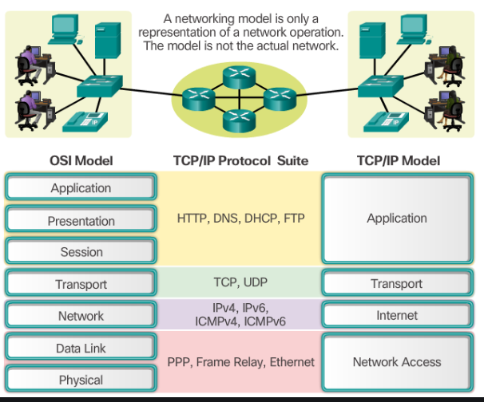
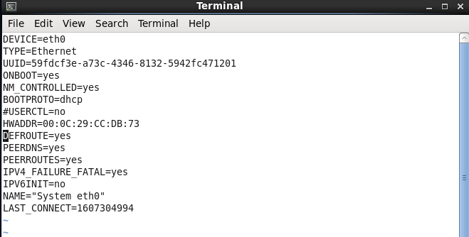
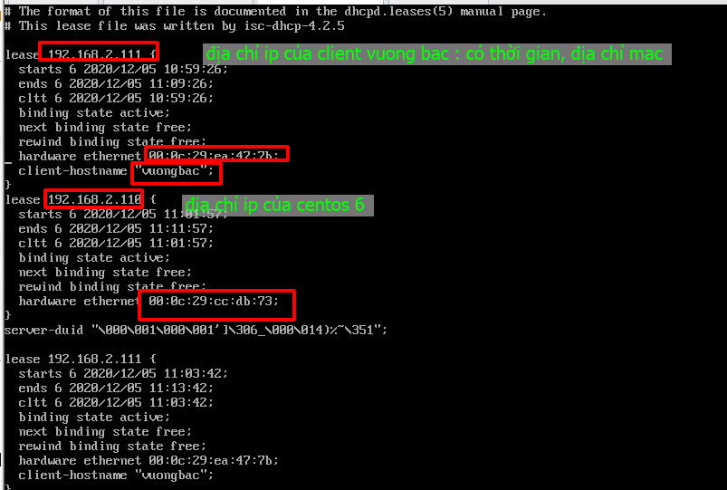
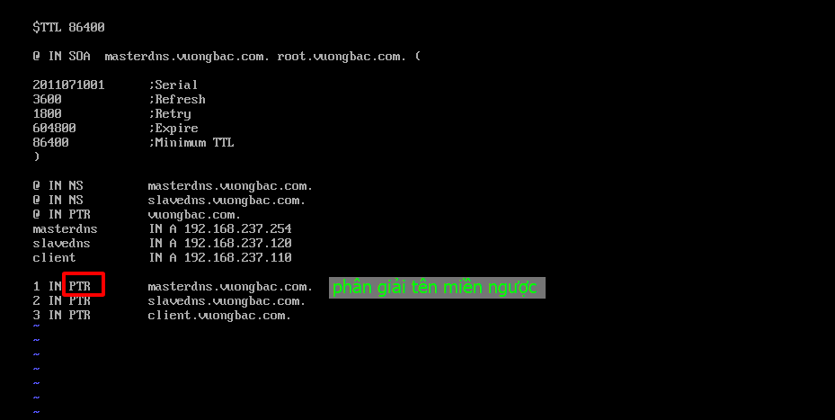
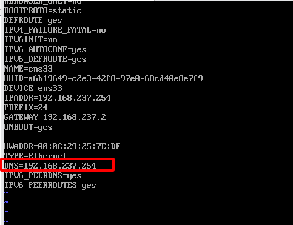
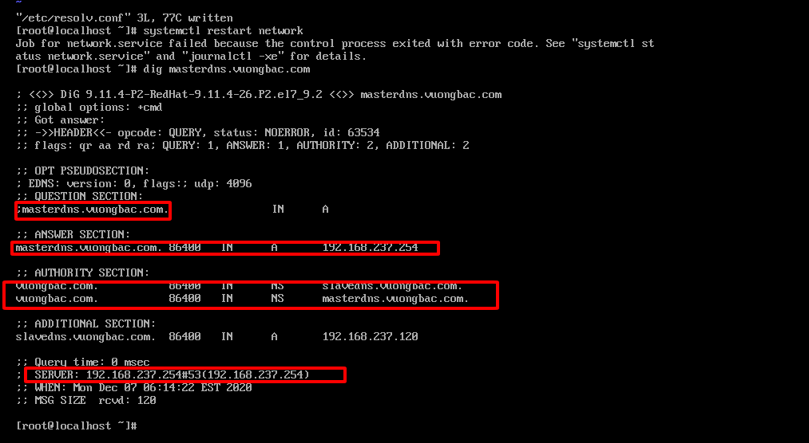
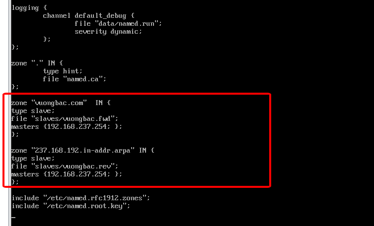
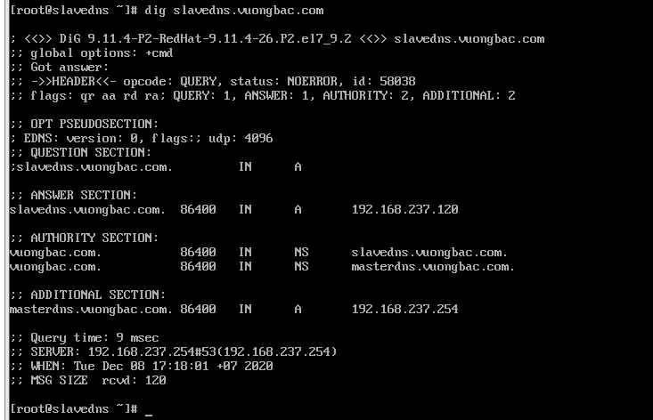

# REPORT 3

[MỤC LỤC](#mucluc)

[1. CONNECTING LINUX TO THE NETWORK](#P1)

* [1.1. Basic network configuration](#p11)

* [1.2. IPv4 addressing (dhcp/static)](#p12)

* [1.3. Network protocols](#p13)

* [1.4. Network services and port numbers](#p14)

* [Managing network devices](#p15)

* [1.6 Hostnames and DNS](#16)

* [Searching domains](p17)

* [Routing under Linux](p18)

* [1.9. Configuring network time & The time zone](p19)


[2.SYSTEM LOGGING](#P2)

* [Rsyslog/syslog configuration](#21)

*  [Testing using logger](#22)

* [Managing logs with logrotate](#23)

* [The systemd journal: journalctl](#24)

[3.TROUBLESHOOTING](#P3)

* [The troubleshooting process](#31)

* [Booting the rescue system/recove7y password]((#31)


<a name="P1"> </a>
# 1. CONNECTING LINUX TO THE NETWORK

<a name="p11"></a>
## 1.1. Basic network configuration

Các bước cơ bản để thêm một máy tính mới vào một mạng cục bộ là như sau:

- Gán địa chỉ IP và tên máy chủ duy nhất.

-  Đảm bảo giao diện mạng được cấu hình đúng tại thời điểm khởi động.

- Thiết lập một tuyến đường mặc định và có lẽ định tuyến fancier.

- Trỏ đến một máy chủ tên DNS để cho phép truy cập vào phần còn lại của Internet

### 1.1.1. Hostname and IP address assignment


## 1.2. IPv4 addreding(dhcp/static)

### 1.2.1. Liệt kê các cart mạng trên Centos 7

Đối với câu lệnh dùng :ip link show


– Hoặc cũng có thể sử dụng lệnh ‘nmcli‘ của chương trình dịch vụ NetworkManager. Nếu card cần cấu hình hiển thị trạng thái ‘connected‘ là card mạng đó đã được cấu hình để được quả lý bởi chương trình Network Manager.


### 1.2.2. Cấu hình IP Tĩnh cho Centos  7

- Đối với chỉnh sửa cấu hình IP tĩnh cho các card mạng tương ứng

 Giờ ta có card mạng thì ta cần tạo 1 file cấu hình có tên tiền tố là ‘ifcfg-<tên card mạng>‘ trong thư mục ‘/etc/sysconfig/network-scripts/‘. Ví dụ dưới đây thì ta sẽ tạo file ‘ifcfg-ens33‘ .
 
 
 
 Dưới đây là các option bạn nên lưu ý khi cấu hình, còn lại để mặc định cũng được.
 
- DEVICE : tên card mạng đã được liệt kê ở phần 1, nên điền chính xác tên card mạng thì hệ thống mới nhận biết được card nào để cấu hình card mạng cho nó.
- NAME : nội dung y như phần DEVICE.
- ONBOOT : phải để option ‘yes‘ thì khi reboot hệ thống, network mới tự động được bật lên với cấu hình card mạng tương ứng.
- BOOTPROTO : cấu hình IP tĩnh hay DHCP. Nếu là DHCP thì để giá trị ‘dhcp’.
- IPV6INIT : tắt chức năng hỗ trợ sử dụng IPv6 trên card mạng ens18.
- IPADDR : địa chỉ IP tĩnh.
- PREFIX : subnet mask của lớp mạng IP sử dụng.
- GATEWAY : địa chỉ IP cổng gateway. Nếu không có gateway thì máy này chỉ làm việc trong mạng local, nếu có gateway, nó được phép đi ra ngoài ví dụ như, ra Internet.
- DNS1 : thông tin DNS server.

Lưu ý: Các dòng không phân biệt hay thứ tự ưu tiên. Chỉ cần có các dòng cần thiết là được

### 1.2.3. Kiểm tra cấu hình

- Sau khi đã hoàn tất cấu hình IP tĩnh như trên thì ta sẽ khởi động lại dịch vụ network trên CentOS 7.

Câu lệnh : #systemctl restart network


- Kiểm tra thông tin IP tĩnh đã cấu hình cho card mạng ens33:

Câu lệnh: ip a s ens33


– Kiểm tra thông tin routing trên CentOS 7

câu lệnh ip r


Kêt quả thu được là địa chỉ ip route của ens 33 là 192.168.237.1 nằm trong dãy mạng 192.168.237.0/24
- Kiểm tra thông tin DNS

câu lệnh : #cat /etc/resolv.conf


- Kiểm tra ping gateway và ping DNS1

Câu lệnh :ping 192.168.237.1 và ping 8.8.8.8

 [trở về mục luc](#mucluc)
 
<a name="p13" > </a>
## 1.3. Network protocols

### 1.3.1. Mô hình OSI: Cách thức mạng hoạt động

Mô hình OSI chia quá trình giao tiếp giữa hai thiết bị mạng thành 7 lớp. Một nhiệm vụ hoặc một nhóm nhiệm vụ được giao cho mỗi lớp trong số 7 lớp này. Tất cả các lớp đều khép kín và các tác vụ được giao cho chúng có thể được thực thi độc lập.



Sau đây là mô tả chi tiết về hoạt động của các giao thức mạng trong mỗi lớp của mô hình OSI:

các lớp trong OSI | Nhiệm vụ |
-----| --------|
giao thức lớp Application | Cung cấp các dịch vụ tiêu chuẩn như thiết bị đầu cuối ảo, tệp, chuyển công việc và các hoạt động.|
giao thức lớp Presentation | Che dấu sự khác biệt về định dạng dữ liệu giữa các hệ thống khác nhau. 
Mã hóa và giải mã dữ liệu, mã hóa và giải mã dữ liệu cũng như nén và giải nén dữ liệu.|
giao thức  lớp Session |Quản lý các phiên và hội thoại của người dùng. Thiết lập và kết thúc phiên giữa những người dùng. |
giao thức lớp Transport | Quản lý việc gửi tin nhắn từ đầu đến cuối trong mạng. Kết xuất phân phối gói tuần tự và đáng tin cậy thông qua cơ chế khôi phục lỗi và kiểm soát luồng.|
giao thức lớp Network | Định tuyến các gói theo địa chỉ thiết bị mạng duy nhất. Kết xuất kiểm soát luồng và tắc nghẽn để ngăn chặn sự cạn kiệt tài nguyên mạng. |
giao thức lớp Datalink | Các gói tin khung. Phát hiện và sửa lỗi truyền gói. |
giao  thức lớp Physical | Giao diện giữa phương tiện mạng và thiết bị.  Xác định các đặc tính quang học, điện và cơ học|

### 1.3.2. Giao thức DHCP 

- Khái niệm

`DHCP viết tắt của từ Dynamic Host Configuration Protocol – Giao thức cấu hình Host động, giúp giảm khối lượng công việc cho quản trị hệ thống mạng. DHCP là một dịch vụ được chạy trên một máy chủ DHCP server. Nó có chức năng quản lý việc cấp phát địa chỉ IP động và các cấu hình TCP/IP. DHCP client là dịch vụ có sẵn trên các máy client. Nó dùng để yêu cầu cấp phát địa chỉ IP và các thông tin DNS cho chính máy client đó`

- Một DHCP server bao gồm bốn mục chính sau:

Options: các thông tin như địa chỉ IP, địa chỉ Subnet Mask, địa chỉ Gateway, địa chỉ DNS,… sẽ được DHCP Server cung cấp đầy đủ thông tin.

Scope: một dãy hay một đoạn địa chỉ IP đã được quy hoạch và chỉ định rõ ràng cho DHCP Server được phép cấp phát IP động thông qua DHCP cho máy tính client.\

Reservation: là những thông tin địa chỉ IP đã được “để dành”, tức cấu hình sẵn địa chỉ IP đó cho một số loại máy tính client.

Lease: Thời gian “cho thuê” hoặc tồn tại của địa chỉ IP động đối với mỗi máy client.

- Quá trình hoạt động DHCP


- chuẩn bị  
 + Server: Centos 7, ip : 192.168.2.2/24
 + Client: Centos6, Centos 
 
 - Đặt Ip tĩnh cho DHCP Server
 
 ` #vi /etc/sysconfig/network-scripts/ifcfg-ens33`
 
 
 
 - Cài đặt dhcp server 
  
  câu lệnh: yum install -y dhcp 
  
  kiểm tra cài đặt thành công hay chưa : rpm -qa | grep dhcp
  
  
  
 – Cấu trúc các file/thư mục của dịch vụ DHCP Server mà bạn cần biết:

`/etc/dhcp/dhcpd.conf : file cấu hình dịch vụ DHCP.

/var/lib/dhcpd/dhcpd.leases : file chứa thông tin các IP động đang cấp qua DHCP.

/var/log/message : log mặc định chứa quá trình DHCP 4 bước.
 `
 - Cài đặt DHCP Server
 
  Sau khi đã cài đặt gói dịch vụ thành công chúng ta chép file cấu hình mẫu tới thư mục /etc/dhcp
  
 `# cp /usr/share/doc/dhcp-4.2.5/dhcpd.conf.example /etc/dhcp/dhcpd.conf
`
Nội dung cấu hình DHCP Server

câu lệnh vào file cấu hình: #vi /etc/dhcp/dhcp.conf


khởi dộng lại dhcp

`#systemctl start dhcpd
`
- cấu hình dhcp ở client

câu lệnh: #vi /etc/sysconfig/network-script/ifcfg-eth0



kiểm tra ở client được cấp phát ip từ DHCP Server chưa : # ifconfg

.

Ta đã thấy ip client là 192.168.2.110 nằm trong dãy địa chỉ ip từ 192.168.2.110 đến 192.168.2.150 của dhcp server cấp phát

Như vậy đã  cấp  hình thành công DHCP 

- kiểm tra các client được cấp phát : # cat /var/lib/dhcpd/dhcp.leases



- Cấp phát 1 ip của thể cho một máy  

Trường hợp này là bạn đang muốn dành riêng 1 địa chỉ IP trong range IP DHCP cho một máy tính cụ thể trong hệ thống mạng

Phần khai báo cấu hình này nằm trong nội dung cấu hình “subnet” của DHCP Server nhé. 


kiểm tra ở client centos7 đã đặt ip của  máy thông qua dhcp chưa


### 1.3.3. Giao thức FTP

##### Khái niệm

FTP - File Transfer Protocol (Giao thức truyền tải tập tin) được dùng trong việc trao đổi dữ liệu trong mạng thông qua giao thức TCP/IP, thường hoạt động trên 2 cổng là 20 và 21. Với giao thức này, các máy client trong mạng có thể truy cập đến máy chủ FTP để gửi hoặc lấy dữ liệu. Điểm nổi bật là người dùng có thể truy cập vào máy chủ FTP để truyền và nhận dữ liệu dù đang ở xa.

##### Cấu hình VSFTPD 

- Chuẩn bị: 

Server: Centos7 , ip 192.168.237.254

Client: Windown7, cài phần mềm Filezilla

- Cài đặt dịch vụ Vsftpd
 
 ` yum install vsftpd `
 
 
 
 Sau đó khởi động lại dịch vụ FTP server -vsftpd 
 
 
 
 Tắt tường lửa cổng 20 và 21 - cổng của vsftpd
 
 ` firewall-cmd --permanent --add-port=20-21/tcp
 firewall-cmd --permanent --add-port=20-21/udp
 firewall-cmd --reload
 `
 

 kiểm tra vsftpd có đang chạy không: systemctl status vsftpd
 
  

- Cấu hình FTPServer - vsftpd

File cấu hình dịch vụ FTP Server Vsftpd nằm ở : /etc/vsftpd/vsftpd.conf

Tìm hiểu và chỉnh sửa file cấu hình vsftpd

` #vi /etc/vsftpd/vsftpd.conf
`
Các cấu hình cơ bản

`anonymous_enable=NO
local_enable=YES
ftpd_banner="Welcome FTP Server - CuongQuach.com"
use_local_time-YES
listen=NO
listen_ipv6=YES
use_localtime=YES
`
Trong đó:
anonymous_enable (YES/NO): cho phép các kết nối ẩn danh, nên tắt đi.

local_enable (YES/NO): cho phép các local user được kết nối.

write_enable (YES/NO): cho phép quyền ghi vào thư mục upload, tương đương quyền upload dữ liệu.

ftpd_banner: dòng thông báo khi kết nối FTP Server.

listen_ipv6 (YES/NO): lắng nghe kết nối ipv6 và ipv4. Khi bạn cấu hình YES phần này, thì ở listen không cần cấu hình YES mà cấu hình NO.

use_localtime (YES/NO): sử dụng thời gian của máy chủ.


Chroot: kỹ thuật giữ người dùng trong thư mục của họ, không cho phép. Tại đây ta sẽ chroot tất cả user, ngoại trừ các user trong file /etc/vsftpd/chroot_list

`
chroot_local_user=YES
allow_writeable_chroot=YES
chroot_list_enable=YES
chroot_list_file=/etc/vsftpd/chroot_list
`


Giới hạn cổng kết nối cho FTP thụ động: Giới hạn khoảng các cổng sử dụng cho FTP passive

`pasv_min_port=30000
pasv_max_port=31000
`
Giới hạn User được phép truy cập vào hệ thống: Nếu muốn giới hạn các User local được đăng nhập vào hệ thống FTP server. Ta thêm vào các dòng sau. Khi đó, những User có trong file /etc/vsftpd/user_list mới được truy cập vào hệ thống.
`
userlist_enable=YES
userlist_file=/etc/vsftpd/user_list
userlist_deny=NO
`


Khởi động lại dịch vụ và cho phép các cổng FTP passive đi qua tường lửa

` systemctl restart vsftpd
firewall-cmd --permanent --add-port=30000-310000/tcp
firewall-cmd --reload
`
##### Truy vấn FTP Server

• Network services and port numbers

• Managing network devices

<a name="16"> </a>
## 1.6.  Hostnames and DNS

### 1.6.1. Hostname

- khái niệm 

Hostname là tên dùng để xác định vị trí của một thiết bị cuối hay end-point trong một mạng máy tính (hay network), endpoint ở đây có thể là một máy tính, một thiết bị USB... được kết nối trong mạng nội bộ.

Hostname cũng được sử dụng bởi các DNS server để bạn có thể truy cập trang web bằng một tên phổ biến, dễ nhớ, tránh việc phải “vật lộn” với một chuỗi số (địa chỉ IP) chỉ để mở trang web.

Thay vào đó, hostname của máy tính có thể được gọi là tên máy tính, tên trang web hoặc tên node. Hostname còn có một cách viết khác là host name.

Có 3 loại hostname

static – Tên máy chủ truyền thống, có thể được đặt bởi người dùng và được lưu trữ trong file /etc/hostname.

pretty – Tên máy chủ UTF8 dạng tự do được sử dụng để trình bày cho người dùng. Ví dụ “VPS Của HOSTVN”.

transient – Tên máy chủ động được duy trì bởi kernel có thể được thay đổi bởi máy chủ DHCP hoặc mDNS trong thời gian chạy. Theo mặc định, nó giống như tên máy chủ tĩnh.

- kiểm tra tên hostname

kiểm tra hostname hiện tại : #hostname


- Thay đổi và kiểm tra trạng thái của hostname

câu lệnh # hostnamectl set-hostname <hostname>
 
 kiểm tra trạng thái # hostnamectl
 
 
 
 ###  1.6.2.  DNS
 
 - khái niệm DNS
 
 DNS là tên viết tắt của Domain Name System hay còn gọi là dịch vụ phân giải tên miền, có tác dụng phân giải địa chỉ tên miền thành địa chỉ IP
 
 DNS chủ yếu hoạt động trên giao thức UDP và cổng 53. Một số hoạt động khác có sử dụng giao thức TCP.

### 1.6.3. Cấu hình DNS SERVER

##### Chuẩn bị

Cấu hình DNS Server cần 3 máy . Trong đó 1 máy làm DNS server chính (Master DNS) ,1 máy làm DNS server phụ (Slave DNS), 1 máy dùng làm Client 

- Máy 1 :DNS Server Master
 
 Hệ điều hành: Centos7
 
 ip : 192.168.237.254/24
 
 hostname: masterdns.vuongbac.com
 
 - Máy 2.DNS Server Slave
 
 Hệ điều hành: Centos7
 
 ip : 192.168.237.120/24
 
 hostname: slavedns.vuongbac.com

- Máy 3: DNS Server Client

Hệ điều hành: Centos6
 
 ip : 192.168.237.110/24
 
 hostname: client.vuongbac.com

#### Cài đặt DNS Server Matster

- Đầu tiên cài đặt gói blind
`yum install bind bind-utils –y
`
- cấu hình DNS Server

Tìm và sửa file /etc/naned.conf
`#vi /etc/named.conf`


- Tiến hành tạo Zone File :

Như đã thấy ở trên file ‘/etc/named.conf’, chúng ta có thêm vào vài dòng trong đó có đề cập đến 2 file Forward và Reserve :

–  Tạo vùng Forward Zone :

Tạo file forward.vuongbac trong thư mục ‘/var/named’ :
thêm vào những dòng sau: 


- tạo vùng  Reserve

tạo file reserve.vuongbac trong mục /var/named

thêm vào các dòng sau:



- Khởi chạy dịch vu DNS Server


- Cấu hình Firewall


- cấu hình SELinux, Permissions, Ownership 


- tiến hành test thử dNS Server
chạy dòng lệnh sau nếu không trả về gì là thành công

`named-checkconf /etc/named.conf`


check Forward Zone bằng dòng sau
`named-checkzone vuongbac.com /var/named/forward.vuongbac`


check Reserve Zone bằng dòng lệnh sau : 
`named-checkzone vuongbac.com /var/named/reserve.vuongbac`


 - tiến hành add DNS Server vào cấu hình card mạng 
 
 

thêm vào địa chỉ ip của name server vào file /etc/resolv.conf
`nameserver 192.168.237.254`

- Test DNS Server

chạy dòng lệnh : dig masterdns.vuongbac.com

  kết quả trả về 
  
  

chạy tiếp dòng lệnh: nslookup vuongbac.com

kết quả là : 


Vậy là DNS Server đã sẳn sàng để sử dụng. Chúng ta chuyển qua bước cấu hình DNS Server Slave.

##### cấu hình DNS Server Slave cũng tương tự cài DNS Server Master

chỉ cần sửa ở file /etc/named.conf  sau :
 
 
 
–  Tiến hành test DNS Server Master:
`dig masterdns.anninhmang.edu.vn

` 


- test DNS server Slave

 

- test phân giải tên miền 

 

#### Cấu hình Client

Đối với tất cả các máy con, add thong tin địa chỉ IP của các máy DNS Server vào file ‘/etc/resolv.conf’

thêm vào :
`nameserver 192.168.237.254

nameserver 192.168.237.120  `

Và test như ở máy master  và slave

• Searching domains

• Routing under Linux

<a name="p19"> </a>
## 1.9. Configuring network time &  The time zone

Trong tất cả hệ điều hành, thời gian hệ thống là một phần không thể thiếu bởi nó ảnh hưởng đến rất nhiều công việc như: Ghi Log, lập lịch công việc, Backup…. 

Các thành phần bắt buộc

- Giao thức Network Time Protocol (NTP)

- Tập tin Timezone data.

### 1.9.1. Giao thức Network Time Protocol(NTP)

NTP là một giao thức đồng bộ thời gian qua mạng, là một giao thức đồng bội đồng hồ của các hệ thống thông tin máy tính thông qua mạng dữ  liệu chuyển mạch gói với độ trễ biến đổi

- Cơ chế hoạt động của NTP:
  * NTP client gửi một gói tin, trong đó chứa một thẻ thời gian tới cho NTP server
  
  * NTP server nhận được gói tin, gửi trả lại NTP client một gói tin khác, có thẻ thời gian là thời điểm nó gửi gói  tin đó đi
  
  * NTP client nhận được gói tin đó, tính toán độ trễ, dựa vào thẻ thời gian mà nó nhận được cùng với độ trễ đường truyền, NTP client sẽ set lại thời gian của nó.
  
  - Cài đặt NTP
  
  ```
  #yum install ntp -y
  # /etc/init.d/ntpd start
  # chkconfig ntpd on
  ```
 Như vậy là đã hoàn thành cài đặt Network Time Protocol, tiếp theo chúng ta thực hiện lựa chọn Timezone cho hệ thống.
 
 ### 1.9.2. Cấu hình Timezone
 
 Trong centos, các tập tịn Timezone nằm ở thư mục /use/share/zoneinfo/, ca
[2.SYSTEM LOGGING](#P2)

• Rsyslog/syslog configuration

• Testing using logger

• Managing logs with logrotate

• The systemd journal: journalctl

[3.TROUBLESHOOTING](#P3)

• The troubleshooting process

• Booting the rescue system/recovery password
